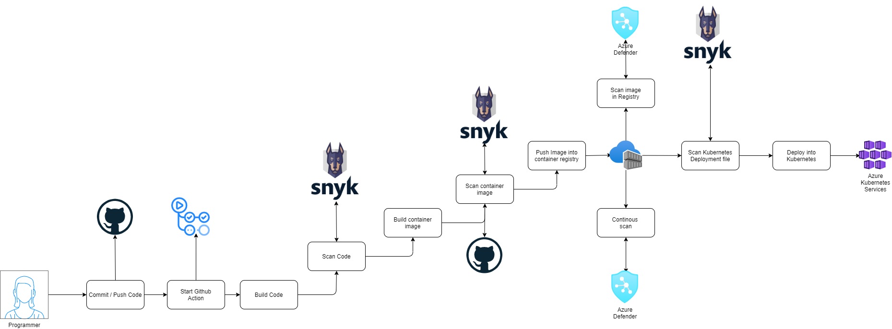

# DevSecOps for Containers

**WORK IN PROGRESS**

## Introduction

This Github repository provides a implementation of DevSecOps for your container workload running in Azure Kubernetes Services.

The application used in this git repository is the [EShop on Dapr](https://github.com/dotnet-architecture/eShopOnDapr).

This repository uses GitHub Action but you could use any CI/CD tools to achieve your DevSecOps.

## What tool we used

Before listing the tool used in this repository here the flow that it's in place (click on the image to scroll for more details).

<ul>
  <li>Static Code analysis - Snyk via vscod extension in ID</li>
  <li>Dependency Scan - Snyk inside Github Action</li>
  <li>Container Scan - Azure Defender/Trivy/Snyk in Github Action and on push/schedule with Azure Container Registry</li>
  <li>Infrastructure as Code - Snyk inside Github Action</li>
</ul>